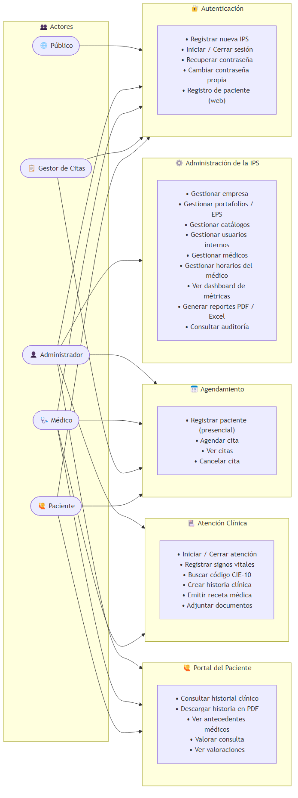
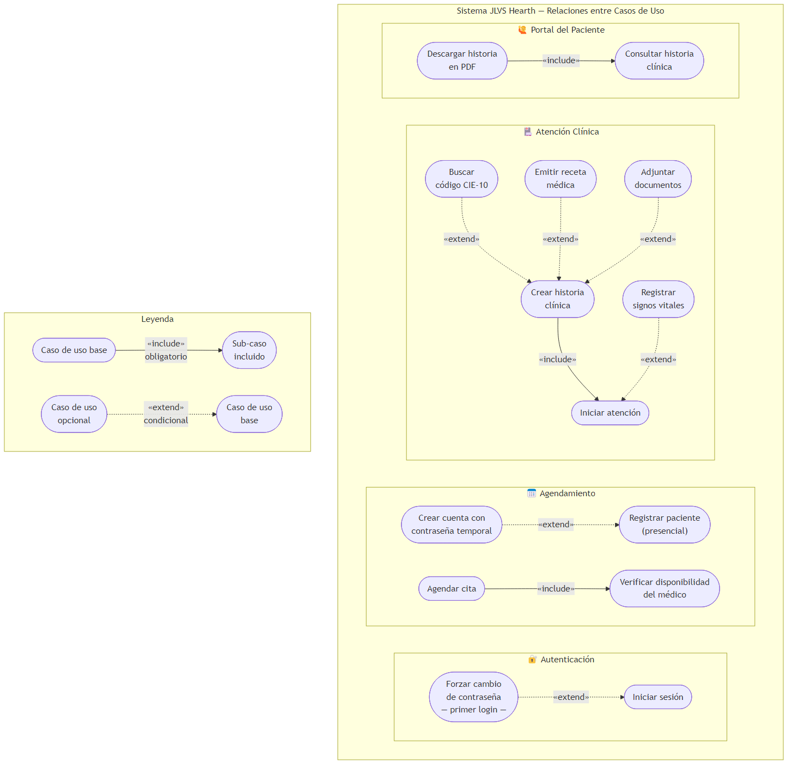
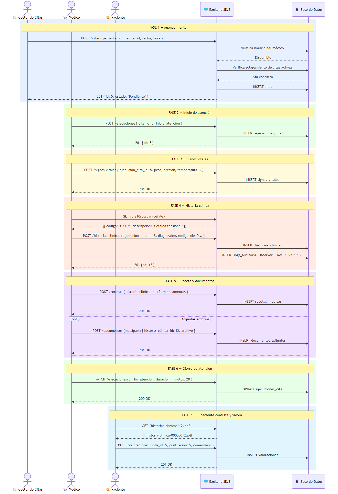
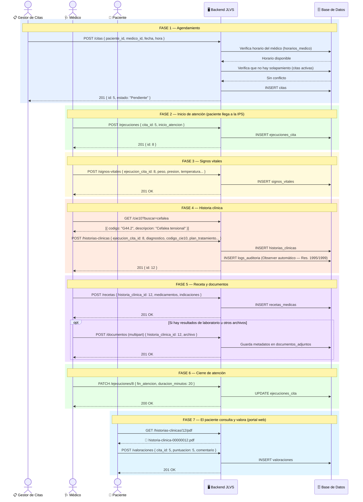
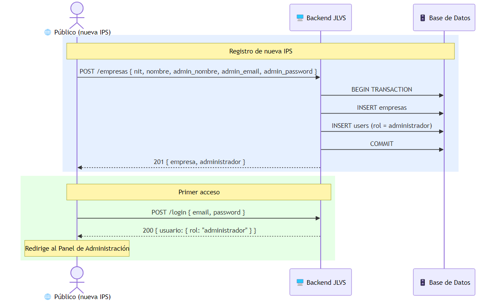
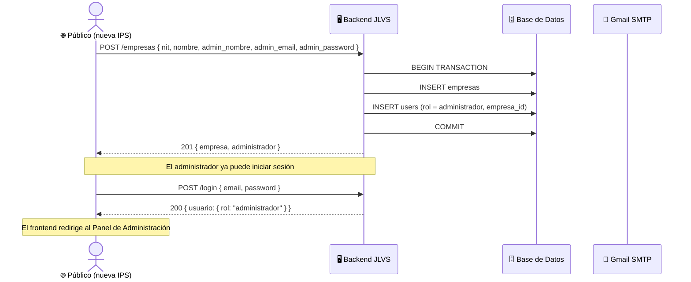
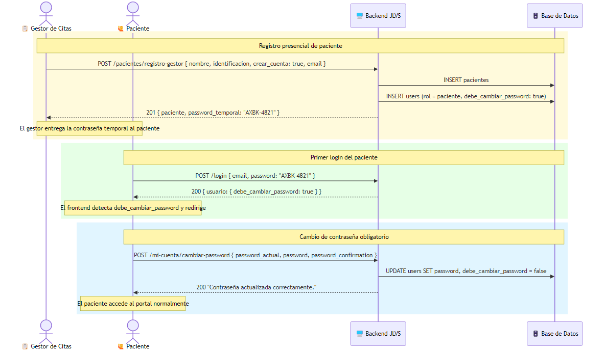
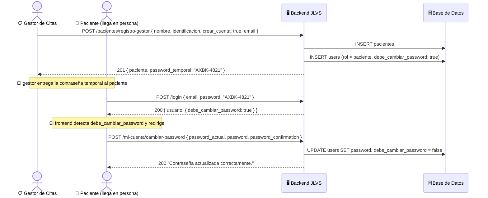

# Diagramas de Casos de Uso — JLVS Hearth

> Las imágenes generadas se encuentran en [`docs/diagrams/`](diagrams/).

---

## Actores del sistema

| Actor | Descripción |
|-------|-------------|
| **Público** | Sin autenticación. Puede registrar una IPS o un paciente, y recuperar contraseña. |
| **Administrador** | Usuario con control total sobre su IPS (multi-tenant). |
| **Médico** | Atiende citas y documenta la consulta clínica. |
| **Gestor de Citas** | Agenda y administra la agenda de la IPS. |
| **Paciente** | Consulta su historial y valora su atención. |

---

## Diagrama de Casos de Uso — Actores y Módulos

---

## Diagrama de Casos de Uso — Relaciones `<<include>>` / `<<extend>>`

| Tipo | Relación | Significado |
|------|----------|-------------|
| `«include»` | sólida | El sub-caso se ejecuta **siempre** como parte del caso base |
| `«extend»` | punteada | El caso extensor es **opcional / condicional** |

### Relaciones `<<include>>`
- **Agendar cita** incluye → Verificar disponibilidad del médico *(siempre valida horario y solapamiento)*
- **Crear historia clínica** incluye → Iniciar atención *(requiere una ejecución activa)*
- **Descargar historia PDF** incluye → Consultar historia clínica *(debe leer antes de generar)*

### Relaciones `<<extend>>`
- **Forzar cambio de contraseña** extiende → Iniciar sesión *(cuando `debe_cambiar_password = true`)*
- **Crear cuenta con contraseña temporal** extiende → Registrar paciente presencial *(cuando `crear_cuenta = true`)*
- **Registrar signos vitales** extiende → Iniciar atención *(opcional según tipo de consulta)*
- **Buscar código CIE-10** extiende → Crear historia clínica *(el médico puede o no usar CIE-10)*
- **Emitir receta médica** extiende → Crear historia clínica *(no toda consulta genera receta)*
- **Adjuntar documentos** extiende → Crear historia clínica *(solo si hay archivos que adjuntar)*

```mermaid
flowchart TD
    %% ─── Actores ───────────────────────────────────────────────
    PUB(["🌐 Público"])
    ADM(["👤 Administrador"])
    MED(["🩺 Médico"])
    GES(["📋 Gestor de Citas"])
    PAC(["🙋 Paciente"])

    %% ─── Módulo: Autenticación ──────────────────────────────────
    subgraph AUTH["🔐 Autenticación"]
        direction TB
        UC_REG_IPS["Registrar nueva IPS"]
        UC_LOGIN["Iniciar / Cerrar sesión"]
        UC_FORGOT["Recuperar contraseña"]
        UC_PASS["Cambiar contraseña propia"]
        UC_REG_PAC_WEB["Registro de paciente (web)"]
    end

    %% ─── Módulo: Administración ─────────────────────────────────
    subgraph ADMMOD["⚙️ Administración de la IPS"]
        direction TB
        UC_EMPRESA["Gestionar datos de empresa"]
        UC_PORTAFOLIO["Gestionar portafolios / EPS"]
        UC_CATALOGO["Gestionar catálogos\n(modalidades, estados, servicios)"]
        UC_USUARIOS["Gestionar usuarios internos"]
        UC_MEDICOS["Gestionar médicos"]
        UC_HORARIOS["Gestionar horarios del médico"]
        UC_DASHBOARD["Ver dashboard de métricas"]
        UC_REPORTES["Generar reportes PDF / Excel"]
        UC_AUDITORIA["Consultar auditoría"]
    end

    %% ─── Módulo: Agendamiento ───────────────────────────────────
    subgraph CITASMOD["📅 Agendamiento"]
        direction TB
        UC_REG_PAC_GES["Registrar paciente (presencial)"]
        UC_AGENDAR["Agendar cita"]
        UC_VER_CITAS["Ver citas"]
        UC_CANCELAR["Cancelar cita"]
    end

    %% ─── Módulo: Atención Clínica ───────────────────────────────
    subgraph CLINICO["🏥 Atención Clínica"]
        direction TB
        UC_EJECUCION["Iniciar / Cerrar atención"]
        UC_SIGNOS["Registrar signos vitales"]
        UC_CIE10["Buscar código CIE-10"]
        UC_HISTORIA["Crear historia clínica"]
        UC_RECETA["Emitir receta médica"]
        UC_DOCS["Adjuntar documentos"]
    end

    %% ─── Módulo: Portal del Paciente ────────────────────────────
    subgraph PACMOD["🙋 Portal del Paciente"]
        direction TB
        UC_HISTORIAL["Consultar historial clínico"]
        UC_PDF["Descargar historia en PDF"]
        UC_ANTEC["Ver antecedentes médicos"]
        UC_VALORAR["Valorar consulta"]
        UC_VER_VAL["Ver valoraciones"]
    end

    %% ─── Relaciones: Público ────────────────────────────────────
    PUB --> UC_REG_IPS
    PUB --> UC_LOGIN
    PUB --> UC_FORGOT
    PUB --> UC_REG_PAC_WEB

    %% ─── Relaciones: Administrador ──────────────────────────────
    ADM --> UC_LOGIN
    ADM --> UC_FORGOT
    ADM --> UC_PASS
    ADM --> UC_EMPRESA
    ADM --> UC_PORTAFOLIO
    ADM --> UC_CATALOGO
    ADM --> UC_USUARIOS
    ADM --> UC_MEDICOS
    ADM --> UC_HORARIOS
    ADM --> UC_DASHBOARD
    ADM --> UC_REPORTES
    ADM --> UC_AUDITORIA
    ADM --> UC_REG_PAC_GES
    ADM --> UC_AGENDAR
    ADM --> UC_VER_CITAS
    ADM --> UC_CANCELAR
    ADM --> UC_EJECUCION
    ADM --> UC_SIGNOS
    ADM --> UC_CIE10
    ADM --> UC_HISTORIA
    ADM --> UC_RECETA
    ADM --> UC_DOCS
    ADM --> UC_HISTORIAL
    ADM --> UC_PDF
    ADM --> UC_VER_VAL

    %% ─── Relaciones: Médico ─────────────────────────────────────
    MED --> UC_LOGIN
    MED --> UC_PASS
    MED --> UC_VER_CITAS
    MED --> UC_EJECUCION
    MED --> UC_SIGNOS
    MED --> UC_CIE10
    MED --> UC_HISTORIA
    MED --> UC_RECETA
    MED --> UC_DOCS
    MED --> UC_HISTORIAL
    MED --> UC_PDF
    MED --> UC_VER_VAL

    %% ─── Relaciones: Gestor de Citas ────────────────────────────
    GES --> UC_LOGIN
    GES --> UC_PASS
    GES --> UC_REG_PAC_GES
    GES --> UC_AGENDAR
    GES --> UC_VER_CITAS
    GES --> UC_CANCELAR
    GES --> UC_CIE10

    %% ─── Relaciones: Paciente ───────────────────────────────────
    PAC --> UC_LOGIN
    PAC --> UC_FORGOT
    PAC --> UC_PASS
    PAC --> UC_VER_CITAS
    PAC --> UC_HISTORIAL
    PAC --> UC_PDF
    PAC --> UC_ANTEC
    PAC --> UC_VALORAR
    PAC --> UC_VER_VAL
    PAC --> UC_CIE10
```

---

## Diagrama Narrativo — Flujo Principal Clínico

Este diagrama muestra el flujo completo de atención desde el agendamiento hasta la valoración de la consulta.

---

## Diagrama Narrativo — Registro de nueva IPS (Onboarding)

---

## Diagrama Narrativo — Registro presencial de paciente

